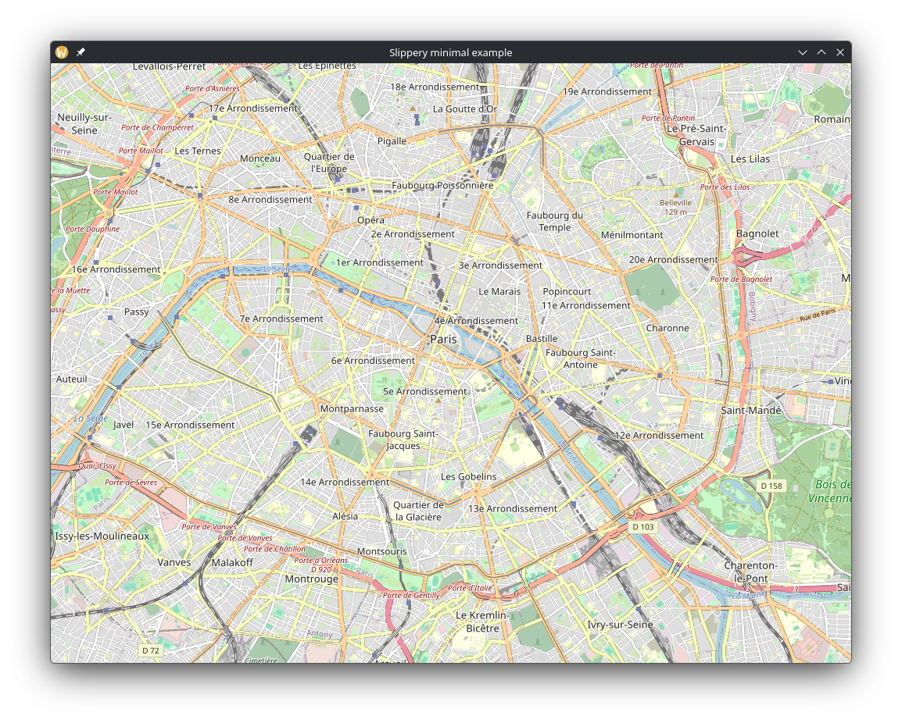

# Slippery
A slippy map widget for the Iced toolkit.

## Features
- Automatically fetch visible tiles from a web source
- Smooth zooming and panning with momentum
- Attach widgets to specific a geographical coordinates

## Example

Try running an example!

```bash
cargo run --release --example minimal
```


