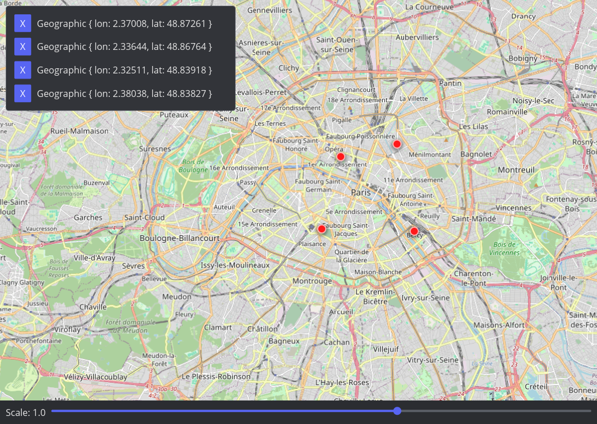

# Slippery
A slippy map widget for the Iced toolkit.



## Example

Try running the example. Click on the map to add a marker, and use the list to remove it.

```bash
cargo run --release --example main
```